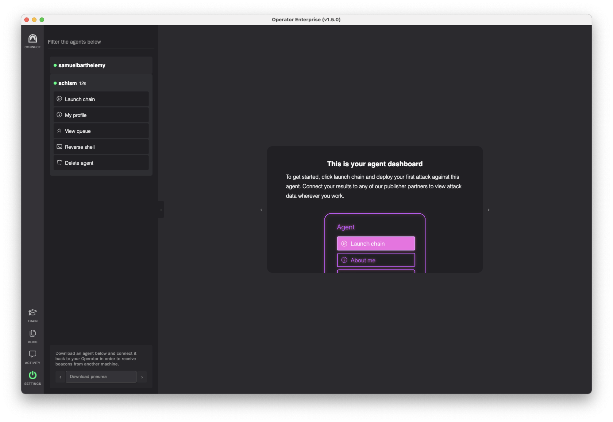
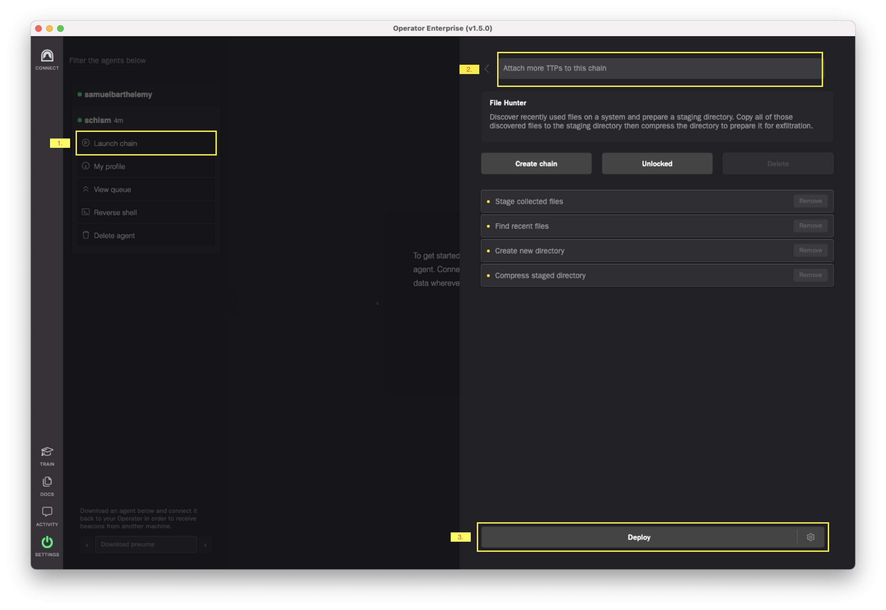

# Operator

### This repository is the spot to report bugs or submit feature requests.

Operator is production-ready infrastructure for continuously testing your security environment. Operator is free & open-source, and provides everything you need to perform realistic offensive security assessments against your cyber defenses.

> Watch our quick [introduction video](https://www.youtube.com/watch?v=Hz8K-jdqpBY)

You can download the latest copy of the application [here](https://www.prelude.org/download/current) for MacOS, Windows or Linux.

## Community

When you start Operator, your app loads in the [community](https://github.com/preludeorg/community) resources in order to populate your environment with hundreds of open-source TTPs, payloads, agents, tools, training modules and more. We encourage contributions, so if you'd like to add TTPs for other Operator members, publish your own agents or come up with a new training flag for any of the programs - submit a pull request!

## Resources 

The Prelude technical team runs several supporting resources for the community:

- A [Discord server](https://discord.gg/NWURE99JzE) to interact with the team.
- A [YouTube video library](https://www.youtube.com/preludeorg) containing tutorials and use cases.
- A [blog](https://feed.prelude.org), where we post on general security and specific Operator topics.
- Details about our [weekly and out-of-band TTP releases](https://chains.prelude.org).

## Quick Start

Whether you are using Operator for the first time or you are checking out the new release, below is a quick rundown of how to get started.

## Installation

> Operator is a multi-platform compiled Electron/NodeJS app.

1. Head to https://www.prelude.org/download/current and download a copy of Operator for your operating system.
2. Double-click the downloaded executable to install Operator the same as any other desktop app.

## Deploying a chain

> When running an operation, keep an eye on the "View Queue" button. Clicking this will show you the procedures from your chain that are awaiting execution by the agent. If any TTPs are skipped or queued, they might be waiting for other TTPs to complete or for a specific dependency to be present.

1. Select the default agent, which we call ThirdEye.
2. Click "Launch Chain".
3. Search for a TTP or chain to run (File Hunter is a great chain to get started with, as it supports multiple operating systems.) 
4. Click "Deploy". This will send the chain to the selected agent.
5. Within a few seconds you should see results starting to stream into your agent's result log. Click on any row to view additional information on the result.
    

## Selecting an Agent for your Operation.

> Using an agent other than ThirdEye (which is baked into the app) allows you to test/control other computers.

1. Download one of Prelude's other agents by clicking the "Add Agents" button in Operator
2. Launch the agent. (Operator runs on localhost by default, most agents are designed to automatically connect to Operator when executed)
3. Your agent should now show up in the list of agents on the side panel.
